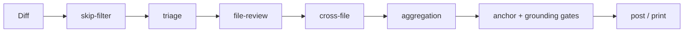

# @gkosach/core — AI Reviewer

Source-available, self-hostable AI code review pipeline.

Every finding is anchored to a real line of a real diff hunk: the model cannot invent a location, and claims about missing imports are re-checked deterministically against the repository before anything is posted. Findings that fail an anchor or a grounding check are dropped, not softened.

## Status

Pre-1.0. Source-available under FSL-1.1-ALv2 (auto-converts to Apache 2.0 two years after each version's release). See `LICENSE.md`.

## Try it in five minutes

No Postgres, no code host, no webhook. Point it at a git repository and it runs the full multi-pass pipeline over a real diff and prints the findings:

```bash
pnpm install
cp .env.example .env
# fill in exactly one variable: OPENROUTER_API_KEY
pnpm run scan -- --base main --head HEAD
```

Any other repository: `pnpm run scan -- --repo /path/to/repo --base main --head HEAD`.
No external provider at all: `LLM_PROVIDER=ollama pnpm run scan -- ...` against a local Ollama.

Useful flags: `--include <regex>` to restrict the file set, `--rules-file <path>` to inject a review playbook, `--no-cross-file` / `--no-triage` to isolate a pass.

## The pipeline



- **skip-filter** — drops lockfiles, generated code, binaries, translations and build output before a token is spent.
- **triage** — a cheap model classifies each hunk; trivial hunks never reach the expensive pass.
- **file-review** — the main per-file pass, with prompt caching on the system prompt and the static context prefix.
- **cross-file** — findings that only exist between files (a caller and a signature that disagree).
- **aggregation** — deduplicates, consolidates recurring same-pattern findings, and scores the change.
- **gates** — anchor validation against the allowable-anchor table for that file, snippet grounding, a confidence floor, and per-file / per-run caps. A finding that fails any gate is dropped.

Across pushes the review is incremental: prior findings, resolved threads and dismissed patterns are carried forward, so a re-pushed branch is not re-reviewed from scratch and the bot does not repeat itself.

## Running the server

The webhook receiver and the review queue:

```bash
docker compose up -d            # Postgres only, on port 5433
pnpm db:migrate
pnpm dev                        # server on port 3000
```

`docker compose` in this repository starts the database, not the application — the application runs from source with `pnpm dev`, or from the production image below.

Point your code host's webhook at `http://your-host:3000/webhook` and set `WEBHOOK_SECRET` to the same value on both sides. The secret is required: an unset secret aborts startup unless you explicitly opt out (see `.env.example`).

Reviewing a GitHub pull request directly, without a webhook:

```bash
pnpm run review:github -- --owner <owner> --repo <repo> --pr <n> --dry-run
```

## Production image

The root `Dockerfile` builds a slim multi-stage image running the webhook + queue server (`node dist/index.js`) with prod-only dependencies:

```bash
docker build -t ai-reviewer .
docker run -p 3000:3000 --env-file .env ai-reviewer
```

The runtime image carries no toolchain, so migrations run separately (`pnpm db:migrate` from a machine that has one) against the same database.

## Supported code hosts

- GitLab — merge-request webhooks, discussions, inline comments, suggestions.
- GitHub — App authentication, pull-request webhooks, review threads, replies, retry/backoff with `Retry-After`.

## Supported LLM providers

- OpenRouter (Anthropic, MiniMax, DeepSeek, and anything else it fronts)
- Ollama (local or Cloud)
- Anthropic direct (roadmap)
- OpenAI direct (roadmap)

## Configuration highlights

| Env                             | Purpose                                                                                                                |
| ------------------------------- | ---------------------------------------------------------------------------------------------------------------------- |
| `REVIEW_LANGUAGE`               | Output language for findings (default `en`; aliases: `ru`, `de`, `es`, `fr`, `ja`, `ko`, `pt`, `uk`, `zh-cn`, `zh-tw`) |
| `LLM_PROVIDER`                  | `openrouter` or `ollama`                                                                                               |
| `CODE_HOST_PROVIDER`            | `gitlab` or `github`                                                                                                   |
| `WEBHOOK_SECRET`                | Shared secret for webhook signature verification; required unless signature checking is explicitly disabled            |
| `WORKSPACE_PACKAGE_PREFIXES`    | Comma-separated workspace prefixes to skip in doc-context resolution                                                   |
| `ARCHITECTURE_SNAPSHOT_ENABLED` | Inject target-repo overview (CLAUDE.md, package.json, src tree) into prompts                                           |
| `SEVERITY_THRESHOLD`            | Lowest severity that gets posted inline                                                                                |

Full list: `.env.example`.

## Architecture

Hexagonal, DDD-light. Ports and domain types are defined in `src/domain/`; adapters depend on them and never the reverse.

- `src/domain/` — ports and types, no infrastructure imports
- `src/application/` — use cases: webhook orchestration, snapshots, overlays, run lifecycle
- `src/pipeline/` — pass orchestrator, prompts, tools, codebase doc-context
- `src/review/` — diff parser, anchor validators, suggestion sanitizer, threading, scoring
- `src/infrastructure/code-host/` — GitLab and GitHub adapters
- `src/infrastructure/llm/` — provider adapters and the prompt cache
- `src/infrastructure/database/` — Kysely repositories and migrations
- `src/di/` — composition root; every class declares its dependencies through `typed-inject`

## Observability

`GET /metrics` exposes Prometheus counters for skipped files, triage skip rate, tokens and cost per model and phase, cache hit rate, review duration and run outcomes. `GET /health` is liveness; `GET /readiness` checks the database.

## Contributing

See `CONTRIBUTING.md`.

## License

Functional Source License 1.1 (FSL-1.1-ALv2), converting to Apache 2.0 two years after each version's release. You may use, copy, modify, and self-host this software for any Permitted Purpose. You may not make it available to others as a Competing Use — a commercial product or service that substitutes for, or offers substantially similar functionality to, this software. For commercial / hosted licensing, contact the Licensor (see `LICENSE.md`).
