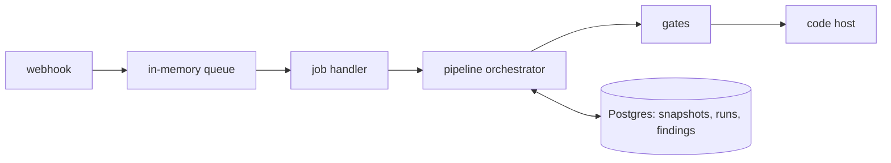
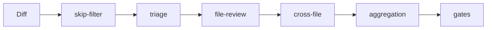

# @gkosach/core — AI Reviewer

Source-available, self-hostable AI code review for merge requests and pull requests.

This document is an architecture note, not a setup guide. It states what the system bets on, what it refuses to do, and where it is currently weak. Operational instructions live in `.env.example`, `scripts/README.md` and `CONTRIBUTING.md`.

Roughly 21k lines of production TypeScript, 12 runtime dependencies, 88 unit spec files and 6 integration test files. Node 24, strict TypeScript (`@tsconfig/strictest`), Fastify, Kysely + Postgres, Zod, typed-inject.

## The bet

An LLM asked to review a diff will produce plausible findings that point at lines which do not exist, quote code it was never shown, and repeat itself across pushes. The usual answer is a better prompt. This engine assumes the prompt will keep failing and puts the load-bearing weight on deterministic checks around the model instead.

Every finding passes gates before it becomes a comment:

- **Anchor validation** — `file_path`, `line_number` and `line_type` must resolve to a real line of a real hunk in that file's diff. A range must not cross a hunk boundary. `src/review/finding-position-validation.ts`
- **Snippet grounding** — when the model quotes `original_snippet`, that text must appear in the diff it was given, normalized. `src/pipeline/passes/file-review.pass.ts`
- **Claim re-checking** — a finding that claims an import target is missing has that path resolved against the real repository at HEAD; if the file is there, the finding is dropped rather than softened. `src/review/import-path-existence-validator.ts`
- **Confidence floor and caps** — below `inlineMinConfidence` (0.7) nothing is posted inline; 10 findings per file, 25 per run, highest confidence first. `src/pipeline/passes/aggregation.pass.ts`

A finding that fails a gate is dropped and logged, never downgraded to a softer comment. The consequence is stated plainly in the trade-offs section: this optimizes precision and does not measure recall.

Diff and PR text reach the model wrapped in `<untrusted_*>` delimiters with an explicit boundary instruction, and any nested delimiter in the content is defanged first. Repository content is data; only the system prompt is instructions. `src/pipeline/prompts/injection-defense.ts`

## Runtime shape



`POST /webhook` verifies the signature, resolves a job key, enqueues, and answers `202`. Everything expensive happens off the request. The queue is `src/infrastructure/queue/job-queue.ts`: concurrency 5, key-based deduplication so a second push to the same MR does not start a second review, 3 retries at 5s / 15s / 60s, and a drain that keeps retrying jobs visible so shutdown does not lose them.

## The pipeline



- **skip-filter** — lockfiles, generated code, binaries, translations, build output. Pure path rules, no tokens spent. `src/pipeline/passes/skip-filter.ts`
- **triage** — a cheap model classifies each hunk so trivial ones never reach the expensive pass. Batched under a 6k prompt-token budget. It is capped at discarding 40% of hunks: if the cheap model wants to skip more than that, the cap wins, because a mis-tuned triage silently gutting a review is worse than the tokens it saves. `src/pipeline/passes/triage.pass.ts`
- **file-review** — the main per-file pass. Prompt caching on the system prompt and the static context prefix; temperature 0. The model has tools (`read_file`, `list_files`, `search_content`, `diff_hunk`) rather than a prepacked context blob, so it pulls what it needs.
- **cross-file** — findings that exist only between files: a caller and a signature that disagree.
- **aggregation** — deduplicates, consolidates a pattern recurring 3+ times into one finding, applies dismissed patterns, scores the change.

Passes implement `IReviewPass` and are injected as an ordered array. Adding a pass is a DI-list edit, not a change to the orchestrator.

## The decision worth questioning first: Postgres as the codebase read layer

The model's `read_file` / `list_files` / `search_content` tools do not call the code host. They read a content-addressed snapshot of the repository stored in Postgres, with the MR's own changes layered on top.

`BaselineService` bootstraps a project by pulling the default-branch archive once, hashing every file with SHA-256, storing deduplicated blobs and a path-to-hash entry table. Default-branch pushes advance the baseline by copying entries forward and rewriting only what changed. `OverlayViewService` then serves reads for one MR: changed files from the MR head, deletions masked, everything else from the baseline snapshot, all under explicit caps on result rows, matches per file and response characters.

What this buys: tool calls do not consume the code host's rate limit, a review is reproducible against a fixed commit, and `search_content` is a Postgres query rather than N API round-trips.

What it costs: storage grows with repository size and commit history, the first review on a project waits for a full archive download (900s timeout), and retention is a manual `POST /cleanup` rather than an automatic policy. On a large monorepo this is the first thing that will hurt.

## State across pushes

A review is incremental by default. `IncrementalReviewService` diffs the previous reviewed SHA against the new head and scopes the delta to hunks the MR actually touches, so a re-push is not a re-review. Prior findings, resolved threads and dismissed patterns are carried into the prompt so the bot does not repeat itself.

Force pushes are the hard case. `ForcePushCorrelationService` correlates old and new commits to decide whether history was rewritten or the branch genuinely moved; when the commit-range check fails, the system refuses to guess and falls back rather than inventing a correlation. This is heuristic and remains the least settled part of the design.

Developer replies feed back in. `ReviewLearningService` classifies a reply into `false_positive`, `accepted_debt`, `clarification`, `agreement` or `dispute`; each false positive records a dismissed pattern for that project, and the aggregation pass suppresses matching findings once a pattern's occurrence count reaches `minOccurrencesToSuppress` (3). One developer disagreeing does not silence a rule; three do.

## Boundaries

Hexagonal, DDD-light, enforced by structure rather than by convention.

- `src/domain/` — ports and types. No infrastructure imports, and `CostBudget` lives here because a spend ceiling is a domain rule, not an adapter detail.
- `src/application/` — use cases: webhook orchestration, baseline, snapshots, overlays, run lifecycle, learning, thread management.
- `src/pipeline/` — pass orchestrator, prompts, tools, doc context.
- `src/review/` — diff parser, anchor validators, suggestion sanitizer, threading, scoring.
- `src/infrastructure/` — code-host adapters (GitLab, GitHub), LLM adapters (OpenRouter, Ollama), Kysely repositories, queue, metrics, rate limiter.
- `src/di/` — composition root. Every injected class declares `static inject = [...] as const` matching its constructor order; wiring is a compile-time error when it is wrong.

Adapters depend on domain interfaces and never the reverse. The public entry point is `src/public.ts`: ports, domain types and `PipelineOrchestrator` are exported so the engine can be embedded without the Fastify server.

## Conventions

`AGENTS.md` in the repository root is the single source of truth for how code is written here, for AI agents and humans alike. Its organizing claim is that a rule which is not mechanically checked is a suggestion, so every rule is listed against the check that enforces it — and the two rules that currently have no check are named as such rather than presented as enforced.

Two of those conventions shape every file and are worth agreeing with before contributing: no comments anywhere in `src/` or `scripts/` (enforced by `src/no-code-comments.spec.ts`, which parses each file with the TypeScript compiler API), and no `any` / `as unknown as` / `@ts-ignore`. Migrations are raw SQL with no re-runnability guards and no defaults on domain columns — those rules and their one documented exception are in `src/infrastructure/database/migrations/README.md`.

## Cost and observability

`REVIEW_MAX_COST_USD` is applied through a `CostBudget` threaded into the use cases — per review run, and separately per comment, thread and learning operation. Reaching the ceiling skips the remaining LLM calls and yields a **partial** result rather than a failure. That is deliberate: a partial review that posts what it found beats an aborted one that posts nothing, but it means a run can silently under-review under budget pressure, and the metrics are where you notice.

`GET /metrics` exposes Prometheus counters for skipped files, triage skip rate, tokens and cost per model and phase, cache hit rate, review duration and run outcomes. `GET /health` is liveness, `GET /readiness` checks the database. `POST /cleanup` purges runs and snapshots past `CLEANUP_RETENTION_DAYS`, requires `Authorization: Bearer $CLEANUP_TOKEN`, and is not registered at all when no token is set.

## Trade-offs and known weak points

Stated up front so they can be argued with rather than discovered.

- **The queue is in-memory and the process is single-node.** `/webhook` answers `202` once queued, so a crash or restart drops every accepted review that has not finished; recovery is a re-push or a comment. Deduplication keys are in-process, so running two instances would double-review the same MR. Durable queueing is the main thing standing between this and a multi-instance deployment.
- **Snapshot storage is unbounded by default.** Retention is an authenticated endpoint someone has to call, not a background policy.
- **Recall is unmeasured.** Every gate is a one-way filter toward precision. Dropped findings are logged with a reason, but there is no corpus establishing how many real defects the gates discard along with the noise.
- **The missing-import re-check is regex-driven** over the finding's prose (English and Russian phrasings), so it catches the common phrasing of a common hallucination, not the general class of ungrounded claims.
- **Force-push correlation is heuristic.** It degrades safely, but "the same finding after a rebase" is not identity-stable in the way it would be with content-hash anchoring.
- **Triage runs a cheap model on the hot path.** The 40% cap bounds the damage; it does not eliminate the failure mode.
- **`REVIEW.md` is read from the target repository**, which means the reviewed project partly configures its own reviewer. Path rules and focus areas are in scope; thresholds and model selection are host-side.

## Supported hosts and providers

GitLab (MR webhooks, discussions, inline comments, suggestions) and GitHub (App auth, PR webhooks, review threads, replies, `Retry-After` backoff). OpenRouter and Ollama for inference; Anthropic and OpenAI direct adapters are on the roadmap and are a port implementation each, not a refactor.

## Verifying the claims cheaply

```bash
pnpm install
pnpm quickstart
```

It asks for an OpenRouter key once, then which repository and which two refs to compare, and prints the findings. No Postgres, no code host, no webhook, and nothing is posted anywhere.

The non-interactive form is `pnpm run scan -- --base main --head HEAD`. Flags, the GitHub PR entry point and the other operator scripts are in `scripts/README.md`; server, database and Docker setup are in `.env.example` and `CONTRIBUTING.md`.

## Status and license

Pre-1.0. Functional Source License 1.1 (FSL-1.1-ALv2), converting to Apache 2.0 two years after each version's release. Use, copy, modify and self-host for any Permitted Purpose; not available for Competing Use — a commercial product or service that substitutes for this software. Commercial and hosted licensing: contact the Licensor, see `LICENSE.md`.
