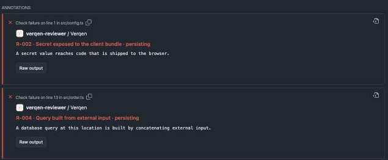

<h1 align="center">verqen/</h1>

<p align="center">
  <b>Automated code check against a published rule catalog.</b><br>
  Every finding names the rule, the file and the line.<br>
  No person reads your code. Nothing in your repository is changed.
</p>

<p align="center">
  
</p>

<p align="center">
  <b>$899 · one repository · one run · up to 400 source files</b>
</p>

<p align="center">
  <a href="mailto:german1kosach@gmail.com?subject=Check%20a%20repository"><b>Check a repository →</b></a>
  &nbsp;·&nbsp;
  <a href="https://app.verqen.dev/rules">Rule catalog</a>
  &nbsp;·&nbsp;
  <a href="https://app.verqen.dev">Website</a>
</p>

## How it works

1. Write to us and pay for the run. You get a one-time link.
2. Open the link, connect GitHub and choose the repository.
3. Minutes later the result is a GitHub Check on the latest commit of your default branch.



A repeat run is compared with the previous one: new, persisting and resolved findings. The service is offered to customers located outside Georgia; see the [terms](https://app.verqen.dev/terms).

## Run the engine yourself

The engine in this repository is source-available.

```bash
pnpm install
pnpm quickstart
```

How it is built: [docs/ARCHITECTURE.md](docs/ARCHITECTURE.md) · License: [FSL-1.1-ALv2](LICENSE.md)
